# BalanceFL — Comprehensive Codebase Documentation

> **Paper**: *"BalanceFL: Addressing Class Imbalance in Long-Tail Federated Learning"*
> **Venue**: IPSN 2022 (21st ACM/IEEE International Conference on Information Processing in Sensor Networks)
> **Authors**: Xian Shuai, Yulin Shen, Siyang Jiang, Zhihe Zhao, Zhenyu Yan, Guoliang Xing

---

## Table of Contents

1. [Project Overview](#1-project-overview)
2. [High-Level Architecture](#2-high-level-architecture)
3. [Repository Structure](#3-repository-structure)
4. [Training Pipeline — End to End](#4-training-pipeline--end-to-end)
5. [Federated Learning Round Lifecycle](#5-federated-learning-round-lifecycle)
6. [Data Pipeline](#6-data-pipeline)
7. [Model Architecture](#7-model-architecture)
8. [Loss Functions](#8-loss-functions)
9. [Aggregation Strategies](#9-aggregation-strategies)
10. [BalanceFL — Core Innovations](#10-balancefl--core-innovations)
11. [Training Scripts (Per-File Documentation)](#11-training-scripts-per-file-documentation)
12. [Core Modules (Per-File, Per-Function)](#12-core-modules-per-file-per-function)
13. [Configuration System](#13-configuration-system)
14. [Multi-Dataset Support](#14-multi-dataset-support)
15. [How to Run](#15-how-to-run)

---

## 1. Project Overview

BalanceFL is a **long-tailed federated learning framework** that addresses class imbalance in distributed settings. In real-world FL, each client's local data often exhibits:

- **Global imbalance**: Some classes have far fewer samples than others across all clients.
- **Local imbalance**: Individual clients may be missing entire classes or have severely skewed distributions.

BalanceFL solves both problems with two core components:

1. **Knowledge Inheritance** — Transfers knowledge from the global model to local models via knowledge distillation, mitigating the class-missing problem.
2. **Inter-Class Balancing** — Combines balanced sampling, feature-space augmentation, and smooth regularization to address local class imbalance.

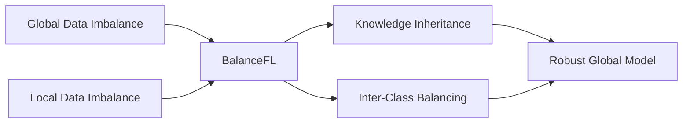

---

## 2. High-Level Architecture

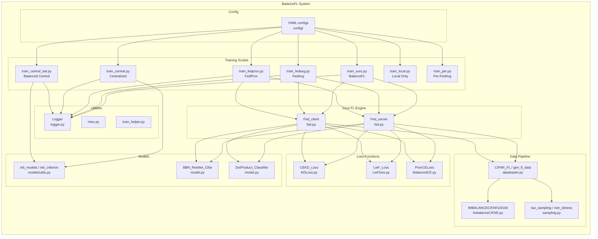

---

## 3. Repository Structure

```
BalanceFL/
├── README.md                          # Project readme with citation
├── figures/                           # Architecture diagrams from the paper
│
├── CIFAR10/                           # Main codebase (Image Recognition)
│   ├── train_ours.py                  # ★ BalanceFL training script
│   ├── train_fedavg.py                # FedAvg baseline
│   ├── train_fedprox.py               # FedProx baseline
│   ├── train_central.py               # Centralized training baseline
│   ├── train_central_bal.py           # Centralized + Balanced CE baseline
│   ├── train_local.py                 # Local (no federation) baseline
│   ├── train_per.py                   # Per-FedAvg (personalized FL) baseline
│   ├── simple_train.py                # Training helper / launcher script
│   ├── fed.py                         # Core FL engine (Fed_server + Fed_client)
│   ├── fed_per.py                     # FL engine for personalized FL (Per-FedAvg)
│   │
│   ├── config/                        # YAML configuration files
│   │   ├── fedlt.yaml                 # BalanceFL (ours) config
│   │   ├── fedavg.yaml                # FedAvg config
│   │   ├── fedprox.yaml               # FedProx config
│   │   ├── central.yaml               # Centralized config
│   │   ├── central_bal.yaml           # Centralized + Balanced CE config
│   │   ├── local.yaml                 # Local training config
│   │   ├── fedper.yaml                # Per-FedAvg config
│   │   └── deepfed.yaml               # DeepFed model config (intrusion detection)
│   │
│   ├── models/                        # Neural network definitions
│   │   ├── model.py                   # ResNet, BBN_ResNet_Cifar, DotProduct_Classifier
│   │   └── utils.py                   # Model/criterion/optimizer initialization
│   │
│   ├── data/                          # Data loading and distribution
│   │   ├── dataloader.py              # FL data splitting, client datasets
│   │   └── ImbalanceCIFAR.py          # Long-tailed CIFAR10/100 datasets
│   │
│   ├── loss/                          # Loss function implementations
│   │   ├── KDLoss.py                  # CE + Knowledge Distillation loss
│   │   ├── LwFloss.py                 # Learning without Forgetting loss
│   │   ├── BalancedCE.py              # Prior-balanced Cross Entropy (LADE-CE)
│   │   ├── SoftmaxLoss.py             # Standard Cross Entropy
│   │   └── WeightedSoftmaxLoss.py     # Weighted Cross Entropy
│   │
│   └── utils/                         # Utility modules
│       ├── misc.py                    # Config update, seeding, AverageMeter
│       ├── logger.py                  # CSV/YAML/HDF5 logging
│       ├── sampling.py                # FL data distribution (tao-based sampling)
│       └── train_helper.py            # Validation, checkpointing
│
├── Speech/                            # Audio (Key Word Sensing) — same structure as CIFAR10/
├── IMU/                               # Action Recognition — same structure as CIFAR10/
│
├── dataset/                           # Raw datasets
│   ├── cifar_10/                      # CIFAR-10 data
│   ├── SpeechCommands/                # Speech Commands data
│   └── IMU/                           # IMU sensor data
│
├── deepfed/                           # Pre-trained DeepFed models and results
├── DeepFed_Analysis.ipynb             # DeepFed model analysis notebook
├── deepfed_explore_train.py           # DeepFed exploration script
└── fedrated_learning.ipynb            # Federated learning notebook
```

---

## 4. Training Pipeline — End to End

The following diagram shows the complete lifecycle of a training run, from config loading to final model saving:

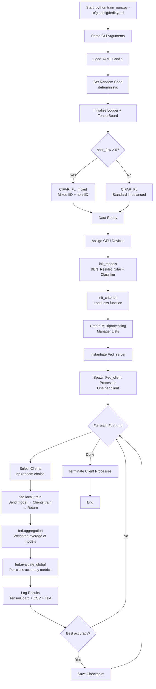

---

## 5. Federated Learning Round Lifecycle

Each FL round involves coordinated communication between the server and client processes using Python's `multiprocessing` module with shared state:

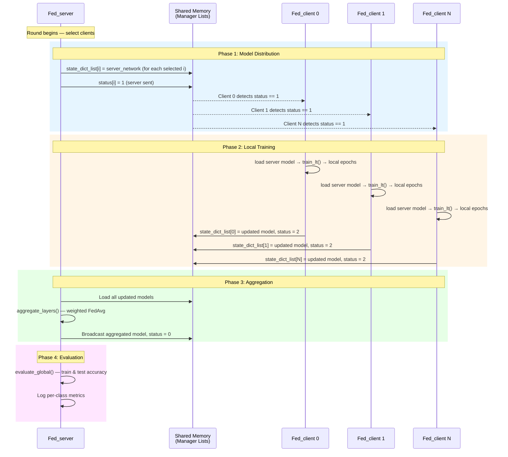

### Status Protocol

| Status | Meaning |
|--------|---------|
| **0** | Idle / original state |
| **1** | Server finished sending model to client (meta-train) |
| **2** | Client finished local training and returned model |
| **3** | Server sent model for meta-test (Per-FedAvg only) |

---

## 6. Data Pipeline

### 6.1 Data Flow Overview

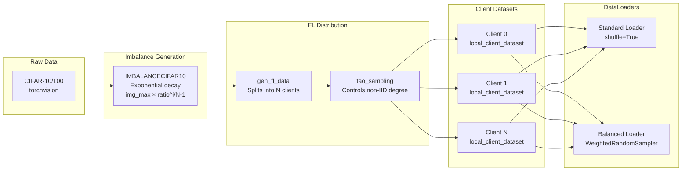

### 6.2 Imbalance Generation — `IMBALANCECIFAR10`

The class creates a long-tailed distribution using exponential decay:

$$n_i = n_{\max} \times \rho^{\frac{i}{C-1}}$$

Where:
- $n_i$ = number of samples for class $i$
- $n_{\max}$ = max samples per class (e.g., 5000 for CIFAR-10)
- $\rho$ = imbalance ratio (`imb_ratio`, e.g., 0.01 → 100:1 imbalance)
- $C$ = total number of classes

### 6.3 Tao-Based Non-IID Sampling

The `tao` parameter controls the degree of data heterogeneity across clients:

- **τ = 1**: Nearly IID — each client gets 1 sample per turn (effectively random)
- **τ = large**: Highly non-IID — clients get contiguous blocks of samples (sorted by class)

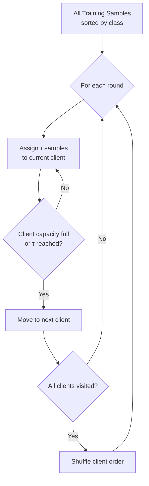

### 6.4 Key Functions in the Data Pipeline

| Module | Function | Purpose |
|--------|----------|---------|
| `ImbalanceCIFAR.py` | `IMBALANCECIFAR10.__init__()` | Creates imbalanced dataset with exponential/step decay |
| `ImbalanceCIFAR.py` | `get_img_num_per_cls()` | Calculates per-class sample counts |
| `ImbalanceCIFAR.py` | `gen_imbalanced_data()` | Prunes dataset to match target distribution |
| `dataloader.py` | `load_CIFAR_imb()` | Loads CIFAR with specified imbalance ratio |
| `dataloader.py` | `gen_fl_data()` | Generates per-client data splits |
| `dataloader.py` | `tao_sampling()` | Core non-IID assignment algorithm |
| `dataloader.py` | `non_iidness_cal()` | Calculates actual non-IID-ness metric |
| `dataloader.py` | `CIFAR_FL()` | Main entry point: imbalanced data → FL splits |
| `dataloader.py` | `CIFAR_FL_mixed()` | Mixed mode: half IID + half non-IID |
| `dataloader.py` | `local_client_dataset` | PyTorch Dataset for one client's data |
| `dataloader.py` | `test_dataset` | PyTorch Dataset for test data |
| `sampling.py` | `DatasetSplit` | Wraps dataset with index-based subset |
| `sampling.py` | `gen_fl_data()` | Alternative FL data generation (uses dataset object) |
| `sampling.py` | `tao_sampling()` | Alternative tao sampling implementation |

---

## 7. Model Architecture

### 7.1 BBN_ResNet_Cifar (Feature Extractor)

The backbone is a **Bilateral-Branch Network** (BBN) variant of ResNet, designed for long-tailed recognition:

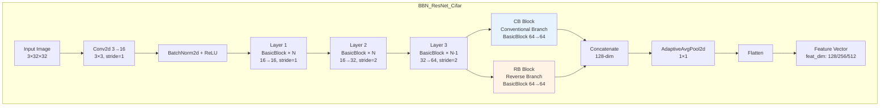

**Supported ResNet Depths**: ResNet8 (channels 16-32-64, feat_dim=128), ResNet20 (32-64-128, feat_dim=256), ResNet32 (64-128-256, feat_dim=512)

### 7.2 DotProduct_Classifier

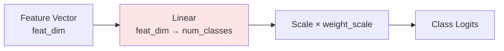

Key features:
- **L2 Normalization** (optional): Normalizes weight vectors for cosine similarity
- **Weight Scale**: Learnable per-class scaling factor (used in Stage 2 training)
- **Two-stage training**: Stage 1 trains FC weights; Stage 2 freezes FC and tunes weight_scale

### 7.3 BasicBlock

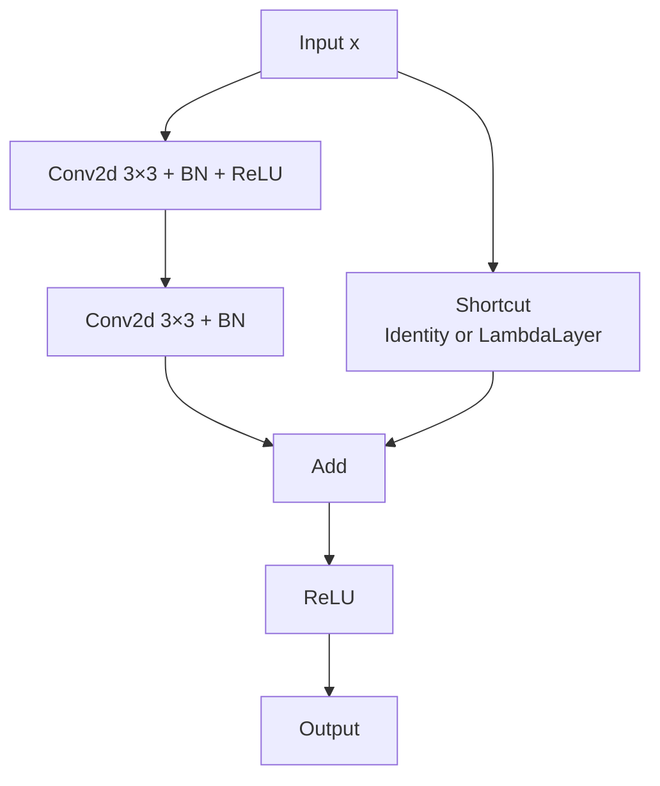

---

## 8. Loss Functions

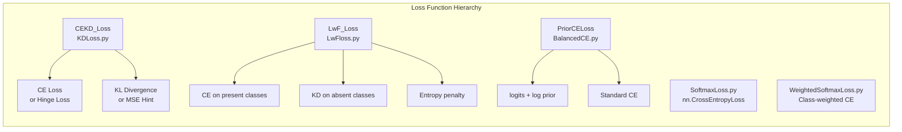

### 8.1 Loss Function Details

| Loss | File | Formula | Used By |
|------|------|---------|---------|
| **CEKD_Loss** | `KDLoss.py` | $\mathcal{L} = \mathcal{L}_{CE} + \lambda \cdot \mathcal{L}_{KD}$ | FedAvg, FedProx, Local |
| **LwF_Loss** | `LwFloss.py` | $\mathcal{L} = \mathcal{L}_{CE}^{pos} + \lambda \cdot \mathcal{L}_{KD}^{neg} - 0.002 \cdot \mathcal{L}_{ent}$ | **BalanceFL (ours)** |
| **PriorCELoss** | `BalancedCE.py` | $\mathcal{L} = CE(\text{logits} + \log(\pi), y)$ | Balanced Centralized |
| **SoftmaxLoss** | `SoftmaxLoss.py` | Standard `nn.CrossEntropyLoss` | Utility |
| **WeightedSoftmax** | `WeightedSoftmaxLoss.py` | Reweighted CE by class frequency | ImageNet-LT |

### 8.2 LwF_Loss — The BalanceFL Knowledge Inheritance Loss

This is the core loss used in BalanceFL. It inherits knowledge from the global (teacher) model:

- **Present classes** (`pos_cls`): Classes that exist in the current client's batch → standard CE
- **Absent classes** (`neg_cls`): Classes missing from the client → KL divergence with teacher predictions
- **Entropy penalty**: Encourages confident predictions on present classes

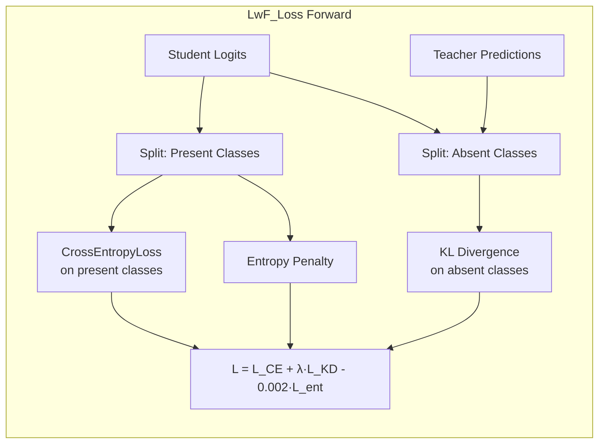

### 8.3 CEKD_Loss — Sub-Components

| Component | Class | Description |
|-----------|-------|-------------|
| `DistillKL` | KD via KL divergence | $p_s = \text{logsoftmax}(y_s/T)$, $p_t = \text{softmax}(y_t/T)$ |
| `Attention` | AT transfer loss | Normalizes spatial attention maps, computes MSE |
| `HintLoss` | Feature regression | MSE between student and teacher features |
| `Hinge_loss` | Squared hinge loss | Based on embedding-weight cosine distance |

---

## 9. Aggregation Strategies

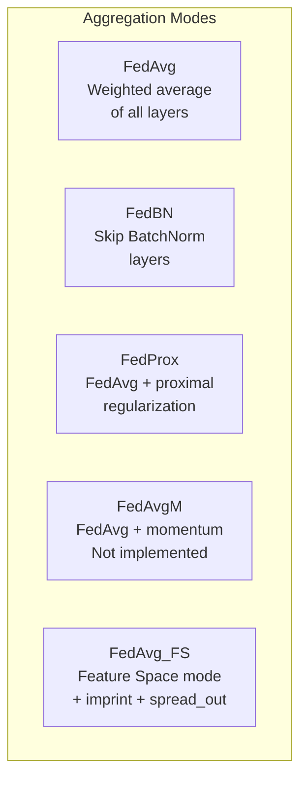

### Aggregation Formula (FedAvg)

For each layer parameter $w$:

$$w_{global} = \sum_{k \in S} \frac{n_k}{\sum_{j \in S} n_j} \cdot w_k$$

Where $S$ is the set of selected clients and $n_k$ is the number of training samples for client $k$.

### Mode Comparison

| Mode | Config Key | Backbone Aggregated | Classifier Aggregated | BN Layers | Extra |
|------|-----------|--------------------|-----------------------|-----------|-------|
| `fedavg` | `aggregation: fedavg` | ✅ | ✅ | ✅ | — |
| `fedbn` | `aggregation: fedbn` | ✅ (non-BN) | ✅ (non-BN) | ❌ | Local BN stats |
| `fedprox` | `aggregation: fedprox` | ✅ | ✅ | ✅ | $+\frac{\mu}{2}\|w - w_g\|^2$ |
| `fedavg_fs` | `aggregation: fedavg_fs` | ✅ | Configurable | ✅ | + imprint + spread_out |

---

## 10. BalanceFL — Core Innovations

### 10.1 Knowledge Inheritance (Global → Local)

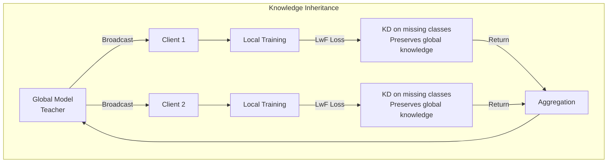

**How it works**: During local training, the client uses the global model as a "teacher". For classes *not present* in the client's local data, the student model is trained to match the teacher's predictions via KL divergence. This prevents catastrophic forgetting of rare classes.

### 10.2 Inter-Class Balancing

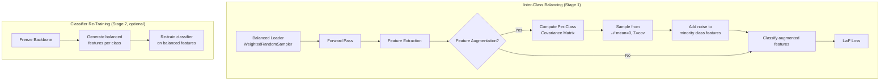

**Feature-Space Augmentation** works by:
1. Computing per-class feature covariance from the teacher model
2. Computing a weighted average covariance across all classes
3. For each sample, with probability $p_i = 1 - \frac{n_i}{n_{\max}}$ (higher for rare classes):
   - Add a random perturbation sampled from $\mathcal{N}(0, \Sigma)$

### 10.3 Two-Stage Training (CRT — Classifier Re-Training)

When `crt: true` in config:

1. **Stage 1**: Train both backbone and classifier normally (with KD + balanced sampling + feature augmentation)
2. **Stage 2**: Freeze backbone, generate balanced features using augmentation, and re-train only the classifier for 5 epochs

---

## 11. Training Scripts (Per-File Documentation)

### 11.1 `train_ours.py` — BalanceFL (★ Main Script)

**Config**: `config/fedlt.yaml`
**Key settings**: `balanced_loader: true`, `feat_aug: true`, Loss: `LwFloss.py`

```
Flow: args → config → dataset(CIFAR_FL) → GPU assignment → init_models/criterion
    → multiprocessing setup → Fed_server + Fed_client spawning
    → FL rounds: select → local_train → aggregation → evaluate → log → save
```

**Unique features compared to baselines**:
- Uses **LwF Loss** (knowledge distillation on absent classes)
- Uses **balanced data loader** (WeightedRandomSampler)
- Uses **feature-space augmentation** (per-class covariance-based noise)
- Optionally uses **CRT** (classifier re-training, stage 2)

---

### 11.2 `train_fedavg.py` — FedAvg Baseline

**Config**: `config/fedavg.yaml`
**Key settings**: `balanced_loader: false`, `feat_aug: false`, Loss: `KDLoss.py` (λ=0 → pure CE)

Standard FedAvg with no balancing strategies. Identical structure to `train_ours.py` but uses simpler loss and no augmentation.

---

### 11.3 `train_fedprox.py` — FedProx Baseline

**Config**: `config/fedprox.yaml`
**Key settings**: `aggregation: fedprox`, Loss: `KDLoss.py` (λ=0)

Same as FedAvg but adds proximal regularization term during client training:
$$\mathcal{L}_{total} = \mathcal{L}_{CE} + \frac{\mu}{2} \|w_{local} - w_{global}\|^2$$

With μ = 0.05 (hardcoded in `Fed_client`).

---

### 11.4 `train_central.py` — Centralized Training

**Config**: `config/central.yaml`

No federation. Combines all client data into one dataset and trains a single model using standard epoch-based training. Uses `validate_one_model()` for evaluation.

---

### 11.5 `train_central_bal.py` — Centralized + Balanced CE

**Config**: `config/central_bal.yaml`
**Loss**: `BalancedCE.py` (PriorCELoss)

Like centralized training but uses balanced cross-entropy loss that adjusts logits by class prior:
$$\mathcal{L} = CE(\text{logits} + \log \pi, y)$$

---

### 11.6 `train_local.py` — Local Training Baseline

**Config**: `config/local.yaml`
**Key settings**: `rounds: 1`, `local_ep: 100`

Runs a single FL round where each client trains independently for 100 epochs. Uses `evaluate_global_all()` to evaluate each client's model independently on the global test set.

---

### 11.7 `train_per.py` — Per-FedAvg (Personalized FL)

**Config**: `config/fedper.yaml`
**Key settings**: `local_ep: 20`

Implements personalized federated learning using `fed_per.py`. Each round has:
1. **Meta-train**: Normal FL training (status=1)
2. **Meta-test**: 1-epoch fine-tuning per client (status=3), then evaluate each client's personalized model

Uses `Fed_server` and `Fed_client` from `fed_per.py` which support the additional status=3 protocol.

---

### 11.8 `simple_train.py` — Training Helper

A launcher that reads config files and prints the appropriate command. Does not perform actual training.

---

## 12. Core Modules (Per-File, Per-Function)

### 12.1 `fed.py` — Core Federated Learning Engine

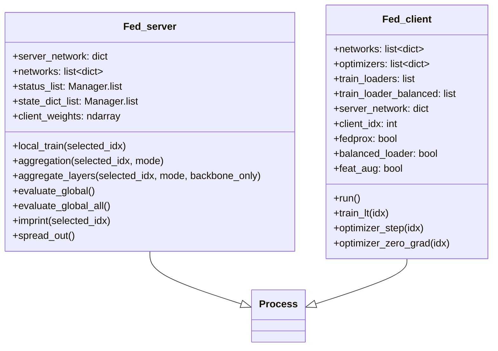

#### Functions in `fed.py`

| Function | Type | Description |
|----------|------|-------------|
| `return_state_dict(network)` | Helper | Copies model weights to CPU dict for IPC transfer |
| `load_state_dict(network, state_dict)` | Helper | Loads weights from dict into model |
| `check_status(status_list, selected_idx, target)` | Helper | Returns True if all selected clients have target status |
| `set_status(status_list, selected_idx, target)` | Helper | Sets status for all selected clients |
| `difference_models_norm_2(model_1, model_2)` | Helper | L2 norm difference between two models (for FedProx) |
| `get_next_batch(dataloader, device)` | Helper | Fetches one batch from dataloader |
| `fedavg(w)` | Standalone | Simple FedAvg aggregation of weight dicts |
| `fedavgm(new_ws, old_w, vel, args)` | Standalone | FedAvg with momentum (partially implemented) |

#### `Fed_server` Methods

| Method | Description |
|--------|-------------|
| `__init__()` | Initializes server network, client copies, datasets, shared state |
| `local_train(selected_idx)` | Broadcasts model → waits for clients → collects updated models |
| `aggregation(selected_idx, mode)` | Aggregates client models based on mode, broadcasts result |
| `aggregate_layers(selected_idx, mode, backbone_only)` | Core weighted averaging of model parameters |
| `evaluate_global()` | Evaluates server model on train and test sets (returns per-class) |
| `evaluate_global_all()` | Evaluates ALL client models individually (for local/per-FL) |

#### `Fed_client` Methods

| Method | Description |
|--------|-------------|
| `__init__()` | Initializes local model, optimizer, data loaders, balanced sampler |
| `run()` | Main event loop: waits for status=1 → trains → returns model → status=2 |
| `train_lt(idx)` | Core training logic: LwF/KD loss, feature augmentation, FedProx, CRT |

---

### 12.2 `fed_per.py` — Personalized FL Engine

Extended `Fed_server` and `Fed_client` for Per-FedAvg algorithm:

| Addition vs `fed.py` | Description |
|-----------------------|-------------|
| `eval_result_list` | Shared memory for per-client evaluation results |
| Status 3 support | Meta-test phase (1 epoch fine-tuning) |
| `Fed_client.evaluate_global()` | Evaluates the personalized (locally fine-tuned) model |
| `Fed_client.run()` | Handles both status=1 (meta-train) and status=3 (meta-test) |

---

### 12.3 `models/model.py` — Neural Networks

| Class/Function | Description |
|----------------|-------------|
| `_weights_init(m)` | Kaiming initialization for Linear and Conv2d layers |
| `LambdaLayer(planes)` | Downsampling via padding (Option A for ResNet) |
| `BasicBlock(in_planes, planes, stride)` | Standard ResNet basic block (2 Conv + shortcut) |
| `Bottleneck(inplanes, planes, stride)` | ResNet bottleneck block (expansion=4) |
| `ResNet(block, num_blocks, channels, ...)` | Full ResNet with configurable depth, L2 norm, dropout |
| `BBN_ResNet_Cifar(block, num_blocks, l2_norm, feat_dim)` | **Main model**: Bilateral-branch ResNet with CB + RB blocks |
| `DotProduct_Classifier(num_classes, feat_dim, ...)` | Linear classifier with learnable weight scaling |

#### `DotProduct_Classifier` Stages

| Method | Stage 1 | Stage 2 |
|--------|---------|---------|
| `stage1_training()` | FC weights trainable, weight_scale frozen | — |
| `stage2_training()` | — | FC weights frozen, weight_scale trainable |
| `weight_norm()` | L2-normalizes FC weights | — |
| `update_weight()` | — | Applies weight_scale to FC weights permanently |

---

### 12.4 `models/utils.py` — Initialization Functions

| Function | Description |
|----------|-------------|
| `init_models(config)` | Creates `BBN_ResNet_Cifar` + `DotProduct_Classifier` based on config (ResNet8/20/32) |
| `init_criterion(config)` | Dynamically loads loss module via `source_import()` and calls `create_loss()` |
| `init_optimizers(networks, config)` | Creates separate SGD/Adam optimizers for backbone and classifier |
| `init_per_classifier(config, cls_number)` | Creates per-class personalized classifiers (for meta-learning) |
| `WarmupMultiStepLR` | Custom scheduler: linear warmup → multi-step decay |

---

### 12.5 `data/ImbalanceCIFAR.py`

| Class | Description |
|-------|-------------|
| `IMBALANCECIFAR10` | Extends `torchvision.CIFAR10` with long-tail imbalance |
| `IMBALANCECIFAR100` | Extends `IMBALANCECIFAR10` for CIFAR-100 |

| Method | Description |
|--------|-------------|
| `get_img_num_per_cls(cls_num, imb_type, imb_factor)` | Computes samples per class using exp/step function |
| `gen_imbalanced_data(img_num_per_cls)` | Prunes original data to match target distribution |
| `get_cls_num_list()` | Returns actual per-class sample counts |

---

### 12.6 `data/dataloader.py`

| Function/Class | Description |
|----------------|-------------|
| `get_data_transform(split, ...)` | Returns train/val/test transforms for different datasets |
| `pil_loader(path)` | Loads image file as RGB PIL Image |
| `non_iidness_cal(labels, idx_per_client, img_per_client)` | Computes non-IID-ness metric (L1 norm of distribution differences) |
| `tao_sampling(img_per_client, tao)` | Generates per-client data indices using tao-based non-IID algorithm |
| `gen_fl_data(train_label_all, num_per_cls, config)` | Main FL data splitting pipeline |
| `load_CIFAR(root, ...)` | Loads balanced CIFAR into memory (shot version) |
| `load_CIFAR_imb(root, ...)` | Loads imbalanced CIFAR into memory |
| `CIFAR_FL(root, config)` | Entry point: loads imbalanced CIFAR → generates FL data splits |
| `CIFAR_FL_mixed(root, config)` | Mixed mode: half IID + many shot; half non-IID + few shot |
| `local_client_dataset` | PyTorch Dataset for one client; provides `get_balanced_sampler()` |
| `test_dataset` | PyTorch Dataset for evaluation |

---

### 12.7 `loss/KDLoss.py`

| Class | Description |
|-------|-------------|
| `DistillKL(T)` | KL divergence distillation with temperature T |
| `Contras(T)` | Contrastive loss (cosine similarity based) |
| `Attention(p)` | Attention transfer loss (spatial attention maps) |
| `HintLoss()` | MSE regression between intermediate features |
| `Hinge_loss()` | Squared hinge loss for embedding-based classification |
| `CEKD_Loss(Temp, lamda, loss_cls, loss_kd)` | Combined CE + KD loss (main loss used by FedAvg/FedProx) |
| `create_loss(...)` | Factory function called by `init_criterion()` |

---

### 12.8 `loss/LwFloss.py`

| Class | Description |
|-------|-------------|
| `LabelSmoothingCrossEntropy(epsilon)` | Label smoothing variant of CE |
| `DistillKL(Temp, mode)` | KL divergence with "kl" or "ce" implementation mode |
| `LwF_Loss(Temp, lamda, loss_cls, loss_kd, ...)` | **Core BalanceFL loss**: CE on present classes + KD on absent classes - entropy penalty |
| `create_loss(...)` | Factory function |

---

### 12.9 `loss/BalancedCE.py`

| Class/Function | Description |
|----------------|-------------|
| `calculate_prior(num_classes, ...)` | Computes per-class priors from imbalanced distribution |
| `PriorCELoss(num_classes, ...)` | LADE-CE: adds `log(prior)` to logits before CE computation |
| `create_loss(...)` | Factory function |

---

### 12.10 `utils/misc.py`

| Function/Class | Description |
|----------------|-------------|
| `check_nan(weight, *args)` | Raises error if NaN detected in weights |
| `get_value(oldv, newv)` | Returns new value if not None, else old value |
| `source_import(file_path)` | Dynamically imports Python module from file path |
| `update_config(config, args, log_dir)` | Merges CLI arguments into YAML config dict |
| `mkdir_p(path)` | Creates directory if not exists |
| `AverageMeter` | Running average tracker (val, sum, count, avg) |
| `deterministic(seed)` | Sets random seeds for reproducibility (random, numpy, torch, cudnn) |

---

### 12.11 `utils/logger.py`

| Class/Function | Description |
|----------------|-------------|
| `write_summary(tensorboard, split, step, **kargs)` | Writes scalars to TensorBoard |
| `print_write(print_str, log_file)` | Prints to console and appends to log file |
| `Logger(logdir)` | Manages logging to YAML (config), CSV (acc/loss), and HDF5 (weight stats) |
| `Logger.log_cfg(cfg)` | Saves config as YAML |
| `Logger.log_acc(accs)` | Appends accuracy dict to CSV |
| `Logger.log_loss(losses)` | Appends loss dict to CSV |
| `Logger.log_ws(e, ws)` | Saves weight statistics to HDF5 by epoch |

---

### 12.12 `utils/train_helper.py`

| Function | Description |
|----------|-------------|
| `shot_acc(loss, acc, shot_num, ...)` | Groups per-class results into many/mid/low-shot categories |
| `acc_loss_per_cls(loss_all, correct_all, labels_all, cls_num)` | Computes per-class accuracy and loss from per-sample results |
| `validate_one_model(model, dataset, device, per_cls_acc)` | **Core evaluation**: runs model on dataset, returns per-class or mean metrics |
| `save_checkpoint(state, is_best, filename)` | Saves PyTorch checkpoint |
| `load_checkpoint(model, ckpt)` | Loads model from checkpoint file |

---

### 12.13 `utils/sampling.py`

| Class/Function | Description |
|----------------|-------------|
| `DatasetSplit(dataset, idxs)` | PyTorch Dataset wrapper for index-based subset |
| `non_iidness_cal(labels, idx_per_client, ...)` | Computes non-IID metric between clients |
| `tao_sampling(img_per_client, tao)` | Non-IID sampling with assertion on tao bound |
| `gen_fl_data(dataset, config)` | FL data generation using dataset object directly |

---

## 13. Configuration System

### 13.1 Config Structure

All YAML configs share this structure:

```yaml
fl_opt:                    # Federated learning options
  rounds: 200              # Number of FL communication rounds
  num_clients: 10          # Total number of clients
  frac: 1                  # Fraction of clients per round (1.0 = all)
  local_ep: 5              # Local training epochs per round
  local_bs: 64             # Local batch size
  aggregation: fedavg      # Aggregation mode
  balanced_loader: false   # Use balanced sampling?
  feat_aug: false          # Use feature augmentation?
  backbone_only: false     # Only aggregate backbone?
  imprint: false           # Use weight imprinting?
  spread_out: false        # Use spread-out regularization?
  crt: false               # Use classifier re-training?

criterions:
  def_file: ./loss/KDLoss.py    # Loss module path
  loss_params: {...}             # Loss function parameters

networks:
  feat_model:
    def_file: ResNet8            # Model architecture
    params: {...}                # Model hyperparameters
    optim_params: {...}          # Optimizer hyperparameters
    feat_dim: 512                # Feature dimension
  classifier:
    def_file: ...
    params: {num_classes: 10, ...}
    optim_params: {...}

dataset:
  name: CIFAR10
  imb_ratio: 0.01               # Imbalance ratio (0.01 = 100:1)
  tao_ratio: 2                  # Non-IID degree
  num_classes: 10

metainfo:
  optimizer: adam                # Optimizer type
  work_dir: ./exp_results
  exp_name: test
```

### 13.2 Config Comparison

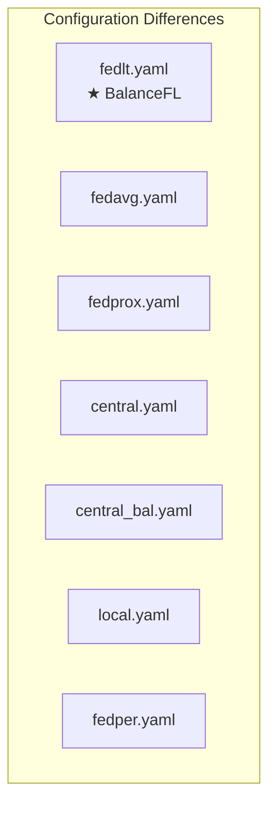

| Config | Loss | balanced_loader | feat_aug | aggregation | local_ep | rounds | Special |
|--------|------|:-:|:-:|-------------|:--------:|:------:|---------|
| `fedlt.yaml` | LwFloss | ✅ | ✅ | fedavg_fs | 5 | 200 | BalanceFL |
| `fedavg.yaml` | KDLoss (λ=0) | ❌ | ❌ | fedavg | 5 | 200 | |
| `fedprox.yaml` | KDLoss (λ=0) | ❌ | ❌ | fedprox | 5 | 200 | μ=0.05 |
| `central.yaml` | KDLoss (λ=0) | ❌ | ❌ | fedavg | 5 | 200 | No FL |
| `central_bal.yaml` | BalancedCE | ❌ | ❌ | fedavg | 5 | 200 | No FL |
| `local.yaml` | KDLoss (λ=0) | ❌ | ❌ | fedavg | 100 | 1 | Single round |
| `fedper.yaml` | KDLoss (λ=0) | ❌ | ❌ | fedavg | 20 | 200 | Meta-test |
| `deepfed.yaml` | KDLoss (λ=0) | ❌ | ❌ | fedavg | 10 | 100 | DeepFed model |

---

## 14. Multi-Dataset Support

The framework supports three modalities with identical code structure:

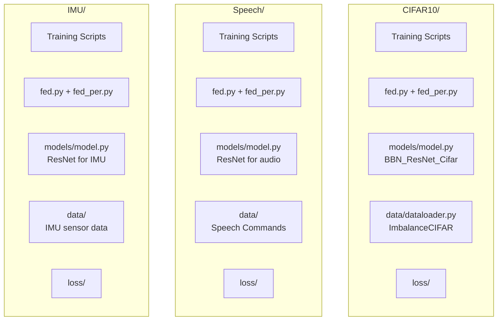

| Dataset | Domain | Classes | Input | Source |
|---------|--------|:-------:|-------|--------|
| **CIFAR-10-LT** | Image Recognition | 10 | 32×32×3 images | Public (auto-download) |
| **Speech Commands-LT** | Key Word Sensing | 10+ | Audio waveforms | Public (auto-download) |
| **IMU** | Action Recognition | varies | Accelerometer/Gyro | Collected (in `dataset/IMU/`) |

Each folder (`CIFAR10/`, `Speech/`, `IMU/`) contains the same set of training scripts, config files, model definitions, loss functions, and utilities — adapted simultaneously for that modality's data format.

---

## 15. How to Run

### Prerequisites

```
Python 3.7.11
pip install torch==1.8.1 torchvision==0.9.1 torchaudio==0.8.1
pip install numpy==1.21.2 librosa==0.6.0 PyYAML==5.4.1 Pillow==8.3.2 h5py==3.4.0
```

### Running Experiments

```bash
cd CIFAR10/

# BalanceFL (Proposed Method)
python train_ours.py --cfg config/fedlt.yaml --exp_name balancefl_exp

# Baselines
python train_fedavg.py --cfg config/fedavg.yaml --exp_name fedavg_exp
python train_fedprox.py --cfg config/fedprox.yaml --exp_name fedprox_exp
python train_central.py --cfg config/central.yaml --exp_name central_exp
python train_central_bal.py --cfg config/central_bal.yaml --exp_name central_bal_exp
python train_local.py --cfg config/local.yaml --exp_name local_exp
python train_per.py --cfg config/fedper.yaml --exp_name perfedavg_exp

# Customize parameters
python train_ours.py --cfg config/fedlt.yaml \
    --exp_name custom_run \
    --tao_ratio 4 \        # Non-IID degree (0.5, 1, 2, 4)
    --lep 5 \              # Local epochs (1, 2, 5)
    --frac 0.6 \           # Client fraction (0.2, 0.6, 1)
    --seed 42 \            # Random seed
    --work_dir ./results   # Output directory
```

### Monitoring

```bash
# View training logs
cat runs_exp/balancefl_exp/log.txt

# TensorBoard
tensorboard --logdir runs_exp/balancefl_exp/tensorboard
```

### Output Structure

```
runs_exp/<exp_name>/
├── cfg.yaml           # Saved config
├── log.txt            # Training log
├── best.pth           # Best model checkpoint
├── acc.csv            # Per-round accuracy
├── loss.csv           # Per-round loss
└── tensorboard/       # TensorBoard events
```

---

*This documentation was auto-generated from the BalanceFL source code. For the original paper, see the [IPSN 2022 proceedings](https://doi.org/10.1109/IPSN54338.2022.00029).*
